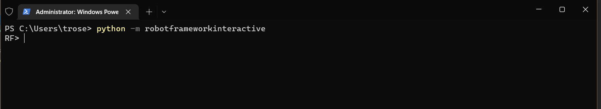
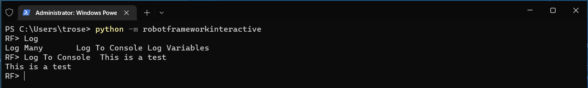
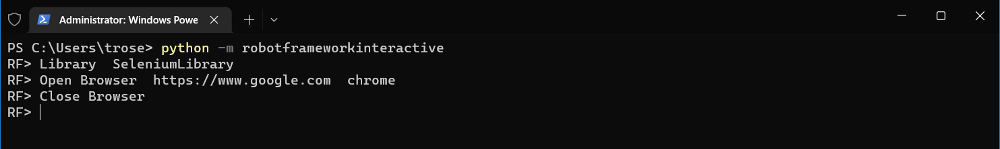
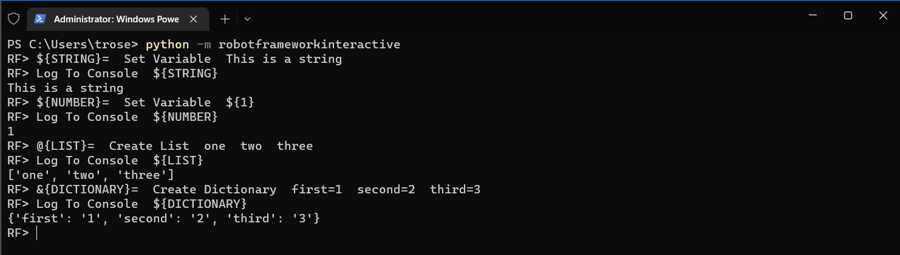
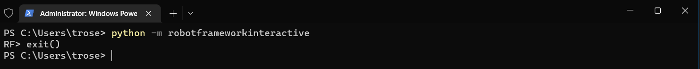

# robotframework-interactive
This project is designed to allow Robot Framework (RF) commands to be ran interactively from the command line. It is 
important to note that not all RF keywords and commands will work as this is reading the input string and determining 
what to run.

## Installation
`pip install robotframeworkinteractive`

## How To Run
`python -m robotframeworkinteractive`

### Running your first command
All the Robot Framework builtins are available right away. If you are on windows, they can be autocompleted by 
pressing the tab button.

### Importing a Library
Any library you have installed in your current python installation are available to be imported. The same can be done 
with any local resources by using the `Library` or `Resource` keywords

### Working with Variables
Just like in your testing, variables can also be set and accessed. 

### Closing the prompt
The prompt can be closed by either typing `exit()` or by hitting ctrl-c twice

## Limitations
* On Linux Clients the autocomplete feature does not work
* Multiline commands do not work (FOR loops, IF statements, etc)

## License
Distributed under the MIT License. See `LICENSE` for more information

## Contact
Tyler Rose - tylerjosephrose@gmail.com

Project Link: https://github.com/tylerjosephrose/robotframework-interactive